<div align="center">



<br/>

<a href="https://github.com/abdelrahman-alqudah">
  
</a>

<br/><br/>

<p align="center">
  <a href="https://www.linkedin.com/in/abd-elarhman/">
    
  </a>
  <a href="mailto:info@abdelrahmanalqudah.dev">
    
  </a>
  <a href="https://abdelrahmanalqudah.dev">
    
  </a>
  <a href="https://github.com/abdelrahman-alqudah">
    
  </a>
</p>

</div>

---

```bash
$ whoami
→ Backend engineer. I design APIs, data models, and the infrastructure around them.
  Security isn't a checklist at the end — it's in the schema and the access rules
  from the first draft.
```

---

## 🔴 Currently

Architecting **U JO RESIDENT** end-to-end on Firebase/GCP — Firestore schema design,
an async pipeline (queue → consumer) instead of synchronous chains, Cloud Run services
sitting behind Cloud Armor, secrets in Secret Manager, and Gemini calls routed through
the API tier instead of exposed client-side. The diagram in the banner above is a piece
of that pipeline, not a stock icon set.

---

## 🛠️ Tech Stack

### Backend
<p>
  
  
  
  
  
  
</p>

### Languages
<p>
  
  
  
  
  
  
</p>

### Data & Infra
<p>
  
  
  
  
  
  
</p>

### DevSecOps
<p>
  
  
  
  
  
  
</p>

### Testing
<p>
  
  
</p>

---

## 💡 What I Do

- **Backend development** — APIs with Laravel & ASP.NET Core, built for the failure case first
- **System design** — schemas, queues, and the boundary between "cache" and "source of truth"
- **DevSecOps** — CI/CD, Cloud Armor, security rules, secrets that live in a vault and not in an `.env` committed by accident
- **Database engineering** — PostgreSQL and Firestore schema design, query and index tuning, Redis caching

---

## 📈 GitHub Stats

<div align="center">


</div>

---

## 📬 Contact

📧 &nbsp;info@abdelrahmanalqudah.dev
📍 &nbsp;Amman, Jordan
🌐 &nbsp;abdelrahmanalqudah.dev

> Open to backend, API, and system design roles. Remote-first, open to discussion. I respond within 24 hours.

---

<div align="center">
  
</div>
